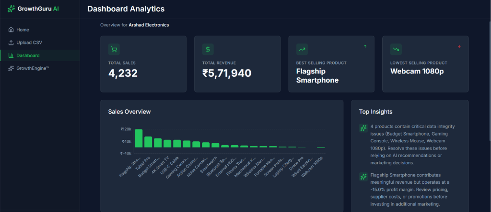
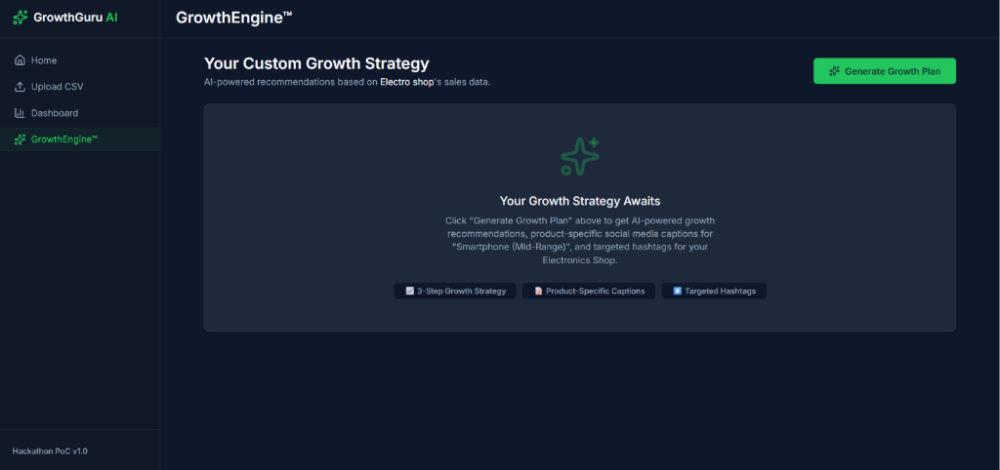
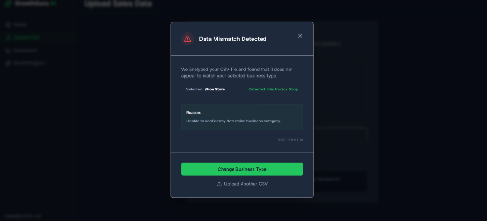

# GrowthGuru AI

> **Empowering small businesses with AI-driven marketing intelligence and automated sales analytics.**

---

## 🚀 Project Overview

Small and medium-sized businesses often struggle to convert raw sales records into high-converting marketing campaigns due to limited analytics resources and domain expertise. Without a dedicated data team, identifying growth opportunities, detecting inventory risks, and planning targeted social media campaigns can be complex and time-consuming.

**GrowthGuru AI** bridges this gap by acting as an autonomous, data-driven Chief Marketing Officer. Powered by Groq LLMs and a high-performance Python analytics backend, it ingests raw transaction data, validates integrity, extracts actionable business metrics, simulates strategic outcomes, and generates ready-to-publish social media campaigns—enabling business owners to execute confident, data-backed decisions.

---

## ⭐ Key Features

### 🤖 Core AI Modules

- 🧠 **Growth Engine** — AI-powered business growth recommendations.
- 📊 **Growth Lens** — Business insights, opportunity analysis & scenario simulation.
- ✅ **Hybrid Validation Engine** — AI + rule-based CSV validation and alignment checks.
- 📱 **Social Studio** — AI-generated product captions and hashtags for product promotion.

### 📈 Business Dashboard

- 📊 **Revenue Analytics** — Comprehensive tracking of revenue trends and key performance indicators.
- 🛍️ **Product Performance** — Identification of top sellers, product sales velocity, and cross-selling targets.
- 📦 **Inventory Insights** — Proactive risk detection for inventory management and stock health.
- 📈 **Sales Overview** — Clear visualization of business volume and sales metrics over time.

### ⚙️ AI Infrastructure

- 🔄 **Smart Model Router** — Automatic Groq model routing and intelligent fallback.
- 🛡️ **JSON Guard** — Structured JSON validation and response integrity.
- 🔍 **AI Forensics** — Token diagnostics, request tracing and execution analytics.
- 📡 **Token Monitor** — AI token usage monitoring.
- ⚡ **Rate Limit Shield** — Intelligent HTTP 429 handling and recovery.

---

## 🛠️ Technology Stack

| Layer | Technology |
|---|---|
| **Frontend** | React 19, Vite, TailwindCSS, Recharts, Lucide React |
| **Backend** | Python 3.10+, FastAPI, Pandas, Uvicorn, Pydantic |
| **AI Inference** | Groq SDK (LLaMA 3.3 70B Versatile, LLaMA 3.1 8B Fallback) |
| **Architecture** | Client-Server REST API, Token-Efficient Pipeline, Hybrid Validation |

---

## ⚙️ System Architecture

```text
[ Raw CSV Upload ]
       │
       ▼
┌─────────────────────────────────────────┐
│ 1. Hybrid CSV & Business Validation     │ (Schema & Rule-based Verification)
└────────────────────┬────────────────────┘
                     │
                     ▼
┌─────────────────────────────────────────┐
│ 2. Pandas Analytics & Summary Engine    │ (KPI Extraction & Data Normalization)
└────────────────────┬────────────────────┘
                     │
                     ▼
┌─────────────────────────────────────────┐
│ 3. Smart Model Router & Groq LLM        │ (LLaMA 3.3 70B / Fallback Execution)
└────────────────────┬────────────────────┘
                     │
       ┌─────────────┼─────────────┐
       ▼             ▼             ▼
┌──────────────┐ ┌──────────┐ ┌────────────────┐
│ Growth Engine│ │GrowthLens│ │ Social Studio  │
└──────┬───────┘ └────┬─────┘ └───────┬────────┘
       │              │               │
       └──────────────┼───────────────┘
                      ▼
┌─────────────────────────────────────────┐
│ 4. React 19 Interactive Dashboard       │ (Visualizations, Scenarios, Captions)
└─────────────────────────────────────────┘
```

---

## 📂 Project Structure

```text
Growth GuruAI/growthguru-ai/
├── backend/                  # FastAPI Backend Service
│   ├── validation/           # Hybrid CSV & Schema Validation Engine
│   ├── config.py             # Global configurations & LLM settings
│   ├── groq_client.py        # Smart Model Router, JSON Guard & Diagnostics
│   ├── insights.py           # Growth Lens & Business Analytics Logic
│   ├── main.py               # Core REST API Endpoints
│   ├── scenario_simulator.py # AI Scenario Simulation Engine
│   └── schemas.py            # Pydantic Request/Response Schemas
├── frontend/                 # React + Vite Web Application
│   ├── public/               # Static assets & sample datasets
│   ├── src/                  # React components, screens, and services
│   ├── package.json          # Frontend dependencies
│   ├── tailwind.config.js    # TailwindCSS configuration
│   └── vite.config.js        # Vite bundler configuration
└── README.md                 # Project documentation
```

---

## 💻 Installation & Setup

### Prerequisites

- **Python**: 3.10 or higher
- **Node.js**: 18.0 or higher
- **Groq API Key**: Available at [console.groq.com](https://console.groq.com)

---

### 1. Backend Setup

Navigate to the backend directory:
```bash
cd "Growth GuruAI/growthguru-ai/backend"
```

Create and activate a virtual environment:
```bash
# Windows PowerShell:
python -m venv venv
.\venv\Scripts\activate

# macOS/Linux:
python3 -m venv venv
source venv/bin/activate
```

Install Python dependencies:
```bash
pip install -r requirements.txt
```

Configure environment variables:
Create a `.env` file in the `backend/` directory:
```env
FRONTEND_URL=http://localhost:5173
GROQ_API_KEY=your_groq_api_key_here
```

Start the FastAPI development server:
```bash
uvicorn main:app --reload --port 8000
```
*Backend API will be running at `http://localhost:8000` (Swagger docs available at `/docs`).*

---

### 2. Frontend Setup

Open a new terminal and navigate to the frontend directory:
```bash
cd "Growth GuruAI/growthguru-ai/frontend"
```

Install Node.js dependencies:
```bash
npm install
```

Configure environment variables:
Create a `.env` file in the `frontend/` directory:
```env
VITE_API_BASE_URL=http://localhost:8000
```

Start the Vite development server:
```bash
npm run dev
```
*Frontend application will be accessible at `http://localhost:5173`.*

---

## 📸 Screenshots

| Dashboard Analytics | GrowthEngine™ Strategy |
|---|---|
|  |  |

| Hybrid CSV Validation | GrowthLens™ Impact Simulator |
|---|---|
|  |  |

---

## 🤝 Team

Developed with ❤️ by **Team PixelForge**.
